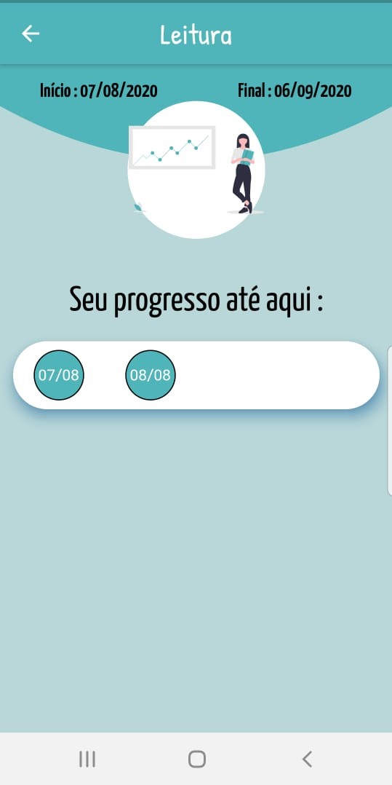

# The Miracle Morning - 30 Day Challenge

This project was made as a side-project to increase my skills as a flutter mobile developer and to create 
something that could help people stay motivated when you're talking about change.

The app is based on the 30-day challenge found on the "The Miracle Morning" book from Hal Elrod.

## What you can do?

In this app you can choose which habit do you wanna start for the next 30 days.
You can read about the habit and why it is benefitial.
You can set if you did or not the habit each day.
You can see your progress in the challenge.
You can receive an random motivacional quote.
You can see your habits records.
You can read some examples about afirmations before you sleep.
You will receive notifications every day to remeber you to keep your progress.

## Technologies

In this app I used MobX to manage the state, and as a dependecy injector I opt for the Flutter Modular package.
The backend was made with Laravel. You can find [here](https://github.com/lucasvps/miracle-morning-api).

## Design

  
  
  
  
  

